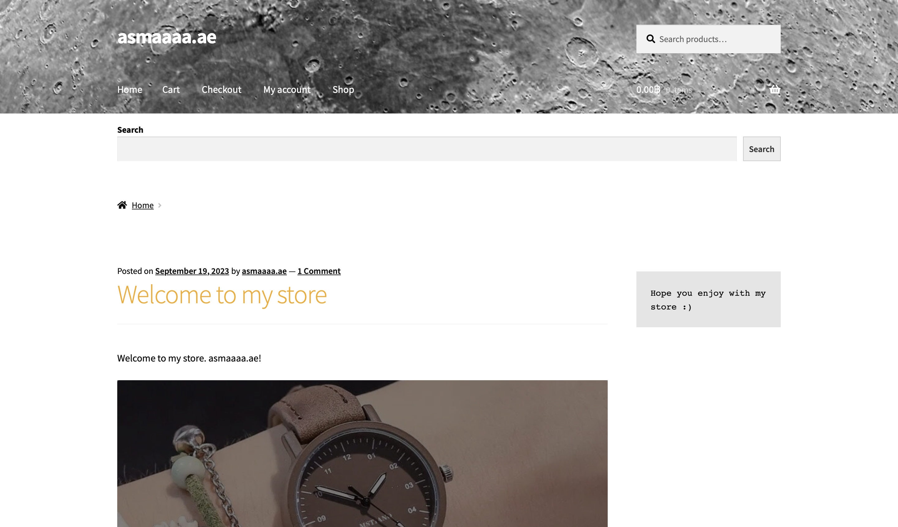
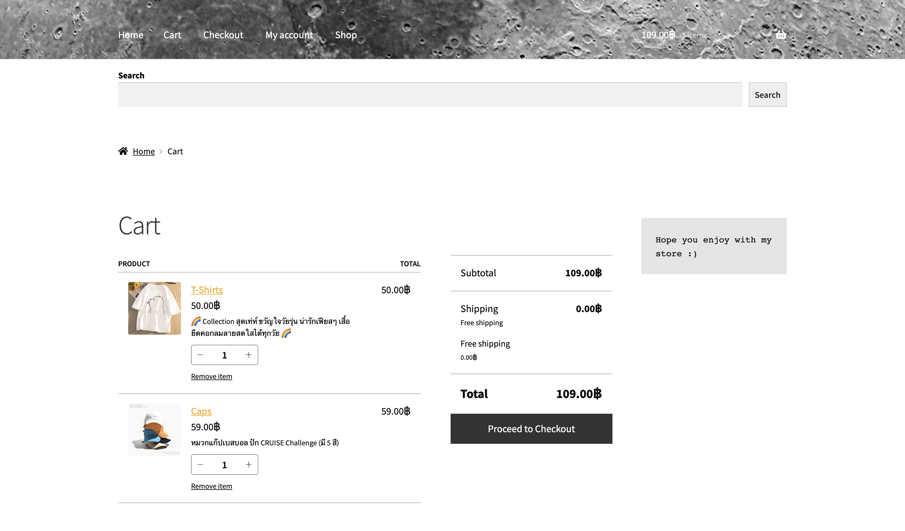
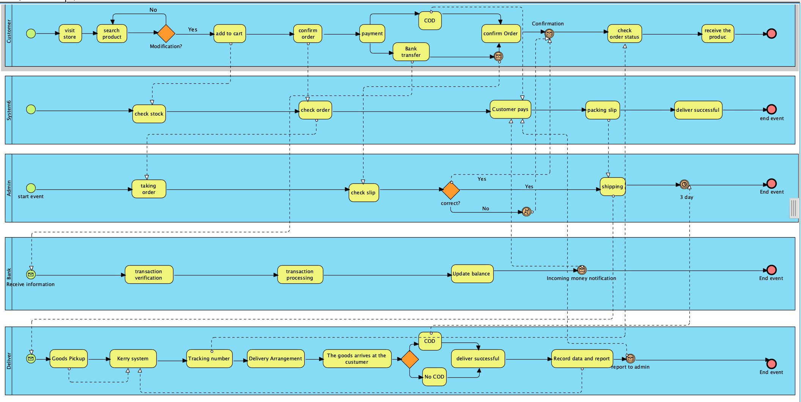
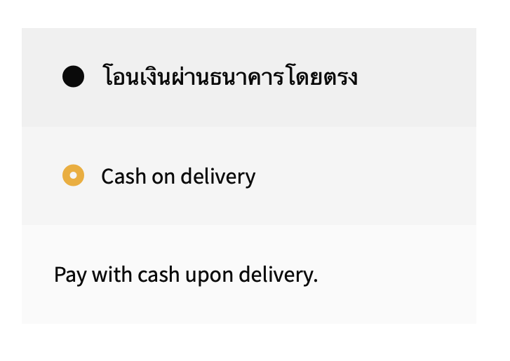
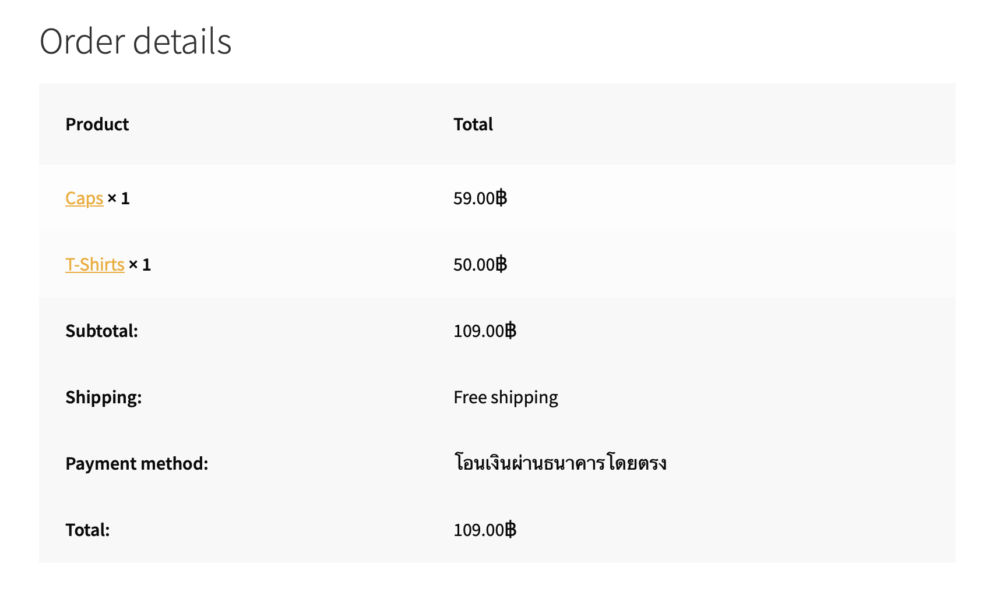
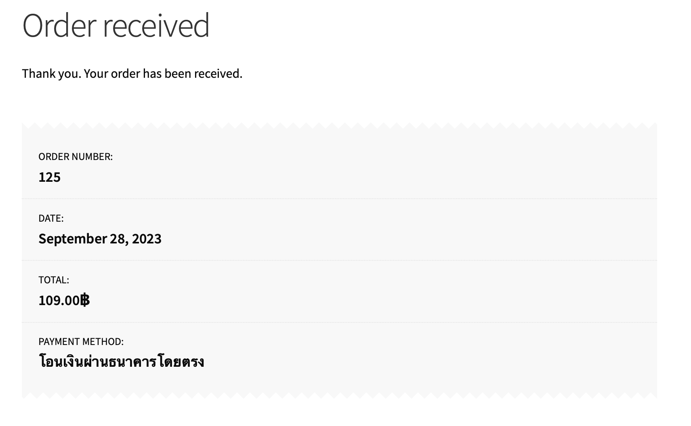
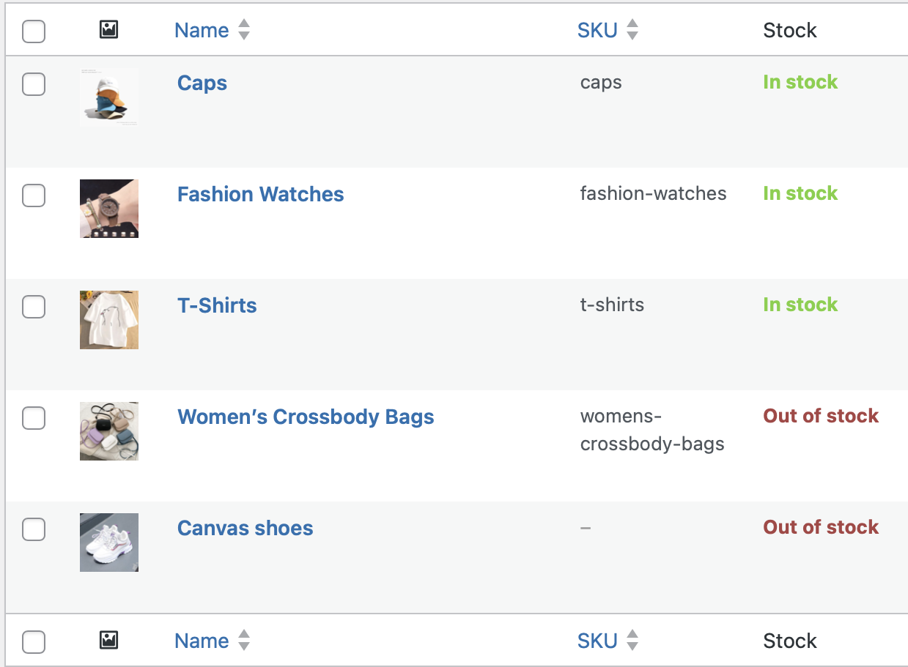

# Modern-Ecommerce-Platforms
Design and Develop Modern Ecommerce Plafform

# Abstract
This project explores the transformation of WordPress into a modern commerce platform, offering businesses an adaptable, user-friendly, and scalable solution for establishing and expanding their online presence. Delving into key features such as plugins, themes, and customization, the project provides valuable insights into leveraging WordPress for successful e-commerce

# Introduction
In an age where digital commerce has become an integral part of our daily lives, businesses are constantly seeking innovative and user-friendly solutions to establish their online presence and thrive in the competitive marketplace. WordPress, a widely acclaimed content management system, has evolved beyond its origins as a blogging platform and emerged as a powerful tool for creating modern and dynamic e-commerce websites. This project aims to explore the transformation of WordPress into a cutting-edge e-commerce platform and the myriad opportunities it offers to businesses and entrepreneurs.

# Software and Tools Used
**MAMP PRO** : MAMP PRO use for development our web. It provides a convenient platform for creating and testing websites asmaaaa.ae E-Commerce before implementation.

**WordPress** : WordPress serves as the primary content management system (CMS) for our website, offering a flexible and user-friendly environment for managing web content.

**WooCommerce** : WooCommerce is fully integrated with WordPress. It gives our website e-commerce capabilities including product management. Shopping cart function and processing through secure payment channels.

**PDF Invoices & Packing Slips for WooCommerce** : This extension is tasked with producing polished invoices and packing slips for customer orders, guaranteeing a seamless and professional shopping experience.

**Jetpack** : Security, performance, and marketing tools made by WordPress experts. Jetpack keeps your site protected so you can focus on more important things.

**MailPoet** : Create and send newsletters, post notifications and welcome emails from your WordPress.

# Method
I developed an E-commerce website using Agile methodologies, an adaptable approach perfectly suited for E-commerce platforms that require continuous evolution. Agile is characterized by its iterative and incremental nature, emphasizing collaboration, adaptability, and responsiveness to customer feedback. This approach is particularly well-suited for projects like the asmaaaa.ae E-commerce website, which demands ongoing updates, feature enhancements, and adjustments to meet shifting customer preferences and market dynamics.

In building the asmaaaa.ae E-commerce website, I selected the Storefont theme as the foundation. Here's how I tailored the project to meet specific needs:

**3.1 Customization and Branding**: I meticulously customized the theme's appearance and layout to harmonize with asmaaaa.ae's unique brand identity, ensuring a unified and visually captivating online presence.

**3.2 Plugin Integration**: To enhance functionality, I seamlessly integrated essential plugins, including WooCommerce and PDF Invoices & Packing Slips for WooCommerce. This integration enables automatic invoice generation, facilitating a professional and efficient ordering process for our customers.

**3.3 Content Management**: Leveraging the robust content management capabilities of WordPress and WooCommerce, I established a streamlined system for organizing and maintaining our product listings and content, ensuring a smooth and user-friendly experience for our visitors.

# Visual Overview
Let's delve into my e-commerce website  asmaaaa.ae, through visual representations. In this section, I'll present a BPMN diagram outlining the essential processes and provide step-by-step screenshots to offer a visual understanding of the user experience and functionality
 **4.1 Website overview**

  **Homepage**

 

 

 

 

  **Shoppage**

 

  **Cart**

 

  **4.2 BPMN Diagram**

 

This BPMN diagram illustrates the processes of my E-Commerce Website, highlighting essential interactions and workflows that contribute to the user-friendly experience of Asmaaaa.ae, our online store.

 
**All Pools in BPMN**

-Customer

-System

-Admin

-Banking system

-Deliver company

&nbsp;&nbsp;&nbsp;**Customer pool**

Depicts the community of users engaging with the platform.

 

**Start Event (Green Circle):** Initiates the customer's voyage on the platform.

**Product Selection:** Customers pick their preferred items from the available choices.

 

**Add Item to Cart:** Following the product selection step, customers review their selections within the cart. If they are content with their chosen products, they proceed to the checkout process. If not, they return to search items again.

 

**Confirm order:** to proceed to the payment process.

**Payment process:** In the payment process, the customer must fill in address details for delivery.

 -**Fill in the details**
 

  
 
 

 -**Select payment channel**
 

  
 
 

 -**Confirm order**
 

  
 
 
 

  
 
 
 

  
 
 

**Check order status:** customer will receive a parcel number after the administrator sends the item and enters the transportation system.

**Recieve the product process:** Recieve the product from shipping company.
**End Event:** Red Circle

&nbsp;&nbsp;&nbsp;**System pool**

Order management system

  
 
 

**deliver successful** deliver successful

**End Event:** Red Circle

&nbsp;&nbsp;&nbsp;**Admin pool**

  

 

 -**Taking order:** Taking order from system.
  **check stock:** The system will check the product to see if it is in stock or not.

 

  
 

 **check order:** The system will check the accuracy of the customer's order.

  

 -**Ckeck slip:** Check slip from customer.

 -**Customer pays:** The system records customer payments.

  

 -**Shipping** 

 -**End Event:** Red Circle

&nbsp;&nbsp;&nbsp;**Banking pool**

  

 

&nbsp;&nbsp;&nbsp;**Deliver pool**

  

 

# Conclusion

In conclusion, WordPress E-commerce presents a dynamic and versatile platform for businesses looking to establish and expand their online presence. It offers a range of customizable themes, plugins, and features that allow for tailored online store development. The integration of WooCommerce, along with other essential plugins, facilitates seamless transactions, inventory management, and a variety of payment options.

The combination of WordPress's user-friendly content management system and E-commerce functionality empowers website owners to efficiently manage products, create engaging content, and optimize their websites for search engines. This flexibility and scalability make WordPress E-commerce suitable for businesses of all sizes, from startups to large enterprises.

Furthermore, the constant support and active community of WordPress users and developers ensure that the platform remains up-to-date, secure, and equipped to adapt to evolving industry trends. Overall, WordPress E-commerce provides a solid foundation for building successful online stores and reaching a global audience.